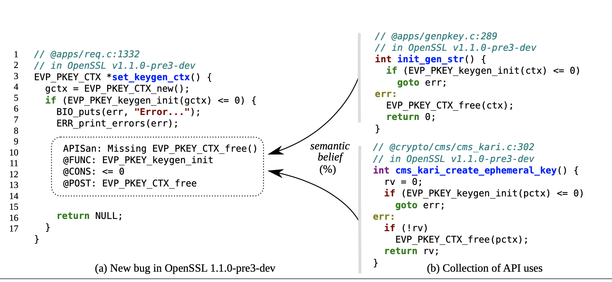
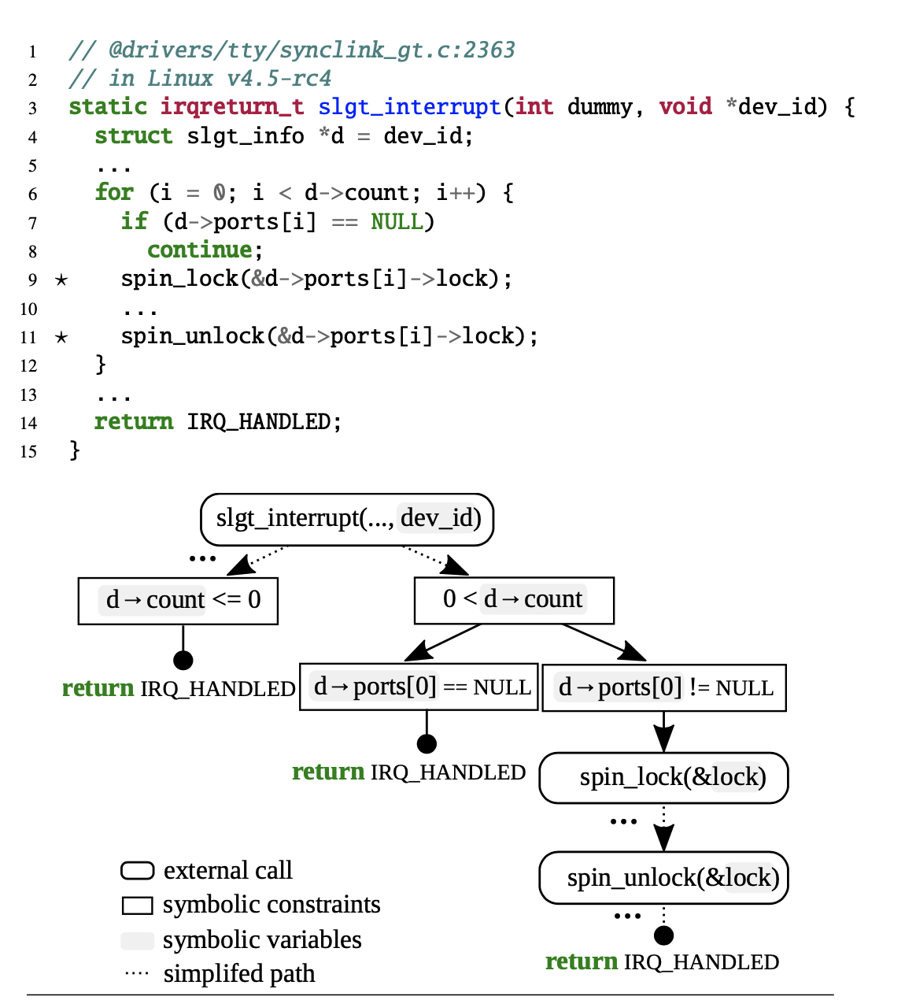
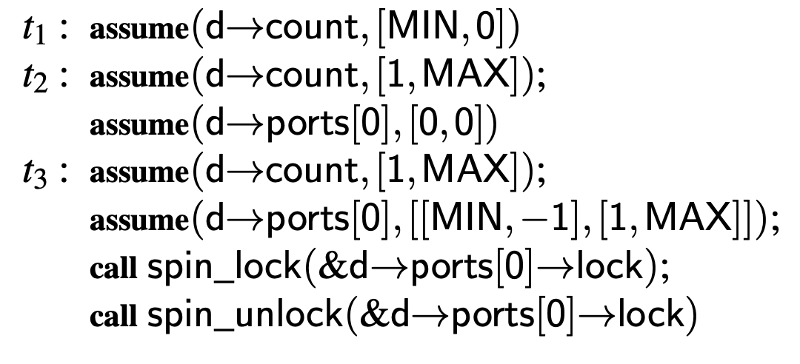
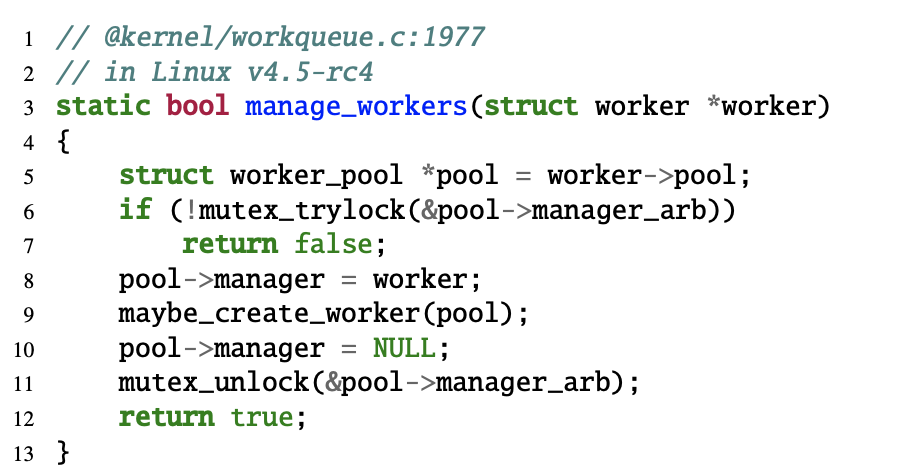
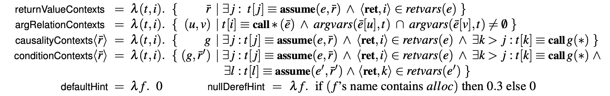

# Paper Reading Report

## Introduction

APISAN is a tool that is aimed to automatically detect API misuses. The key idea is to learn a pattern of how APIs are used and then mark deviations as possible bugs.

Above is an example that helps to illustrate this. On the right is a collection of similar usages where when handling error it is required to free a pointer before returning. On the left is a bug where one forgets to free the pointer when handling error. After learning this pattern from a large number of examples similar to the right, the tool reports the deviation on the left as a bug.

The workflow consists of three steps.

## Step 1: Building symbolic contexts

The first step is to convert the code into symbolic representation.

There are two important features: one is to ragard all function calls as symbolic symbols and never 'dive into' the implementation of the APIs. The other is unroll the loop only once in order to simplify the execution tree.

Above is an example of how the symbolic representations are built. Firstly it is converted to a tree graph that diverge according to the conditional and loop statements in the code. Then each path in the graph is converted to a sequence of 'assume's and 'call's.

## Step 2: Inferring semantic beliefs

The second step is to extract semantic rules out of a large amount of symbolic contexts. The method can 'discover' rules on itself, as long as it is given patterns of rules to look for. In the paper, four patterns are given.

### Implication of return values

Return values of a function often indicate its execution status. For example, we must check if the return value of `malloc()` is NULL. 

Above is a bug found in Linux. The `kthread_run()` function either returns a pointer or a non-zero error code, so the error is never reported.

### Relations on arguments

There may be restrictions on arguments of a function call. For example, in `memcpy(d,s,n)`, the size of the destination `d` should be equal or greater than the copy length `n`.

### Constrained Causal Relationships

Some operations have causal relationships. For example, after `malloc()` one needs to `free()`. More commonly there are conditional causal relationships. In the example below, one needs to call`mutex_unlock()` only if `mutex_trylock()` succeeds.

### Implicit pre- and post-conditions

There are certain conditions that must be met when we call certain APIs. For example, `SSL_get_verify_result()` returns a meaningful value only if `SSL_get_peer_certificate()` returns a valid certificate.

All of the above four patterns can be represented as a semantic formula, namely

From which we can see more clearly the distinction between causalities and conditionals.

## Next week

Read, understand and run the code.

## Future plan

Come up with more patterns.